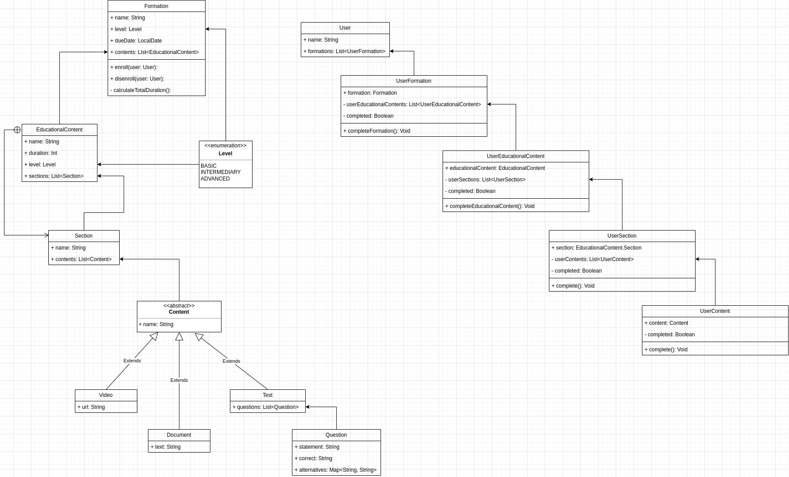

# Dio Kotlin Abstraction (Português)

Este repositório foi criado para completar um desafio na plataforma [Digital Innovation One](https://www.dio.me/).
O desafio é abstrair a plataforma usando Orientação a objeto. O projeto ainda tem espaço para crescer.

### UML

### Melhorias 
- Usar Interface para criar um objeto "completável", ela teria um contrato "complete()".
  > Todas a relações do usuário deveriam usar 
- Usar Interface para criar um object "Matriculável", ela teria os contratos "enroll()" e "disenroll".
  >A priore o que está na minha cabeça é a classe User e Formation utilizando 
- Organizar os arquivos em packages

# Dio Kotlin Abstraction (English)

This repository was create to complete a challenge on [Digital Innovation One](https://www.dio.me/) plataform. 
The challenge is to abstract the plataform using Object Orientation. This project
still has space to grow.

### UML

### Improvements
- Use Interface to create a "completable" object, the interface would have a "complete()" contract
  > All of the User relations would use it
- Use Interface to create a "enrollable" object, it would have a "enroll()" and "disenroll()" contract
    >At first what i think is the User and the Formation class using it. 
- Organize the files in packages.

